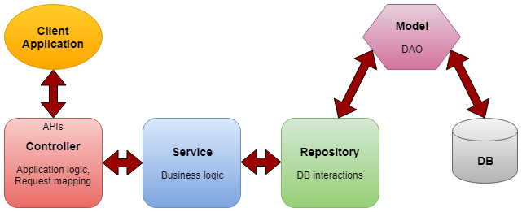
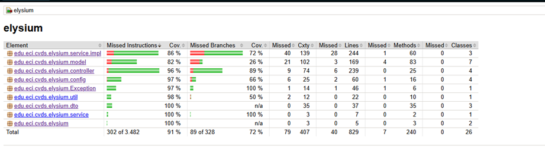

# Elysium-Back: Sistema de Reserva de Laboratorios 🏫


Elysium-Back es un sistema de gestión de reservas de laboratorios para la Decanatura de Ingeniería de Sistemas de la Escuela Colombiana de Ingeniería Julio Garavito. Esta API REST permite gestionar la disponibilidad de laboratorios, realizar reservas y cancelar reservas, todo implementado con una arquitectura moderna y robusta.

## Tabla de Contenidos 📋

- [Integrantes](#integrantes)
- [Tecnologías Utilizadas](#tecnologías-utilizadas)
- [Arquitectura](#arquitectura)
- [Sprints y Desarrollo](#sprints-y-desarrollo)
  - [Sprint 1: Scrum - DI/IOC](#sprint-1-scrum---diioc)
  - [Sprint 2: CI/CD](#sprint-2-cicd)
  - [Sprint 3: Integración con React](#sprint-3-integración-con-react)
  - [Sprint 4: Autenticación y Autorización](#sprint-4-autenticación-y-autorización)
  - [Sprint 5: SSL y Seguridad Avanzada](#sprint-5-ssl-y-seguridad-avanzada)
- [Patrones de Diseño](#patrones-de-diseño)
  - [Data Transfer Objects (DTO)](#data-transfer-objects-dto)
  - [Repository Pattern](#repository-pattern)
  - [Service Layer](#service-layer)
- [Dependencias del Proyecto](#dependencias-del-proyecto)
- [Configuración del Proyecto](#configuración-del-proyecto)
- [Documentación API (Swagger)](#documentación-api-swagger)
- [Estructura del Proyecto](#estructura-del-proyecto)
- [Contribuciones](#contribuciones)

## Integrantes

- Andersson David Sánchez Méndez
- Cristian Santiago Pedraza Rodríguez
- Ricardo Andres Ayala Garzon
- Santiago Botero García


## Tecnologías Utilizadas 🛠️

- **Java OpenJDK 17**: Lenguaje de programación principal
- **Spring Boot**: Framework para el desarrollo de aplicaciones web
- **Spring Security**: Módulo de seguridad para autenticación y autorización
- **Spring Data MongoDB**: Para la integración con MongoDB
- **MongoDB Atlas**: Base de datos NoSQL en la nube
- **Postman**: Ambiente pruebas formato JSON con los métodos POST, GET, PATCH, DELETE.
- **Maven**: Herramienta de gestión de dependencias
- **JUnit 5 & Mockito**: Framework para pruebas unitarias
- **Docker**: Contenedorización de la aplicación
- **Azure DevOps**: Gestión ágil del proyecto
- **GitHub Actions**: CI/CD pipelines
- **Jacoco**: Cobertura de código
- **SonarQube**: Análisis estático de código
- **Swagger/OpenAPI**: Documentación de API REST
- **SSL**: Certificados para conexión segura
- **Lombok**: Reducción de código boilerplate

## Arquitectura 🏗️

El proyecto está construido siguiendo una arquitectura de capas:



La arquitectura se divide en las siguientes capas:

- **Controladores (Controllers)**: Manejan las peticiones HTTP y respuestas.
- **Servicios (Services)**: Contienen la lógica de negocio.
- **Repositorios (Repositories)**: Interfaces para acceso a datos.
- **Modelos (Models)**: Entidades de dominio y DTOs.
- **Configuración (Config)**: Configuraciones de Spring Boot y seguridad.
- **Excepciones (Exceptions)**: Manejo personalizado de errores.

## Diagrama de componentes


Link: https://uml.planttext.com/plantuml/svg/hLVBRjGm5DrNwZ-OsI0MeoAMg1frNdqWIgkPgLW02vEuKwkE7Mo7CaBzTwuJEx4TPreecr5oVCxrVTZtPawKnb9N1KDBjbEqAj1wfpGfq5mKfU24QxIWU2jnSNXmUF0g9xUK4xHQpZVJJsSVboXZM2cpfEufBp7mKEQKQxrZ187jTybbzFlm0A4PpkwtKbGydmic9FfyHpMf5uJCYMp06GEM0QTIYeS0UpIRb_28jmIDN12dKd1DU3v2nyShacdCjunC9isMNuwFMoScawzyHN2cqRGi6Ssmfe9_GrYX6WKmfPXUNw0raJzfHchkjAJsDSckz1qyMkFeKkGLipfOQLxJVYam2ZHFuR1XrOsgiAGYK3biMBN639u3aONsQ3JM15rY3gal06jK1komeGAPiW_LfoMRD7_4Eo97pK8wjNCejHIC4Tdcj8FICfkFIDb3qs9RWaZSGutuqVm48TbZyaHOrXF_Y8NGNizyMGYbPVDAQL7S0751DAPCXVl6S3gm5Ic5ebh8tVDYw_X-U1sQ5jTdCf96sDxKHD8UEbIqh99KxmPZSWIe_YtTDbu5K5hsuK6lo8-AA7rAcRO72S3cRL1peobpLFESTdeX2aphRaFOKyNmIx0dyLswzoRPJssQkDXSgPfb7jBkDtchPDqp1_s_57mhlAnxxzPitNuo9geSciylI2l7pCuuPStcMEFlMC6cjNmnGrCDOstK6WJ4xU_wxt9-SOvpQ9YBMHF8pD_lTJk04ELsJqbO7OkweoN4xCOB6eydtln0xr6bI6-zdHFfzN0gf3dX34XpWfRVKhpT1vqDzXzWHHuCi48VdfETQEIq95C7EsVWgyFrPQG5KjPSL9DmTDYinUqlI4l4jXSoZhXdqs_bSH8ZSjZ0WzXSYud325kFSwnfAc0WipVBcEdmmM1_OaRXXi1HVw3wBfPq4NSyBI3bZjuusXY3pCjkJ4HUHrdn4kMDbYYnFdaWKH7iCPDcUmdOxuU9peCXmCBqsu7OFAPd5emLzU5rXp-YrPXFwlllHUKJ4rao3HSeMcAkReKiR0mBrmBXS73u7ZEk7nvutRGHpwBZauwhffL4AggqEGtfiFgiT5nzdjzVnzq5BugAsszik9nTpnY_VJEElWh1ulbcStrqVRNUe2DSqYCcjlGVP99imIqpgsDb_-fRyTdIQYlR3lz2sstyNyH7lsd-234qpVjbfbJJjckJByb6x9CfzeMPeRSuCqUEkcSqGYFtlTyI4klcJkzRjwVEeoHQUxoB5z-R_cgwySUUH3QYrVGyI7WRcKc5Sm8N1Fw6_m40

## Diagrama de clases


## Sprints y Desarrollo 🏃‍♂️

- ÉPICA


- FEATURES

Cada back tiene su rama feature correspondiente


Cada feature tiene su descripción, su criterio de aceptación historias de usuario y sus tareas asociadas.


Cada historia de usuario tiene descripción, criterio de aceptación, feature y tareas asociadas


Cada tarea tiene su descripción


### Sprint 1: Scrum - DI/IOC


#### Objetivos Alcanzados:

- Implementación de Inversión de Control (IoC) y Dependencia de Inyección (DI) utilizando Spring Boot
- Desarrollo de la estructura básica del proyecto con arquitectura en capas
- Implementación de la persistencia de datos con MongoDB Cloud
- Definición del modelo de datos: laboratorios y reservas
- Creación de endpoints REST para CRUD de reservas


#### Estructura de Modelo:

```java
@Document(collection = "salones")
public class Salon {
    //We declare mnemonico as the id of the salon
    @Id
    private String mnemonico;
    private String nombre;
    private String descripcion;
    private String ubicacion;
    private int capacidad;
    private List<Recurso> recursos;
    private boolean disponible;
    private boolean activo;
    // getters and setters
}

@Document(collection = "reservas")
public class Reserva {

    @Id
    private String idReserva;
    private LocalDate fechaReserva;
    private double hora;
    private DiaSemana diaSemana;
    private String proposito;
    private String materia;
    private String idSalon;
    private EstadoReserva estado;
    private boolean duracionBloque;
    private int prioridad;
    private int idUsuario; 
    // getters and setters
}
```

#### Implementación del Repository:

```java
@Repository
public interface ReservaRepository extends MongoRepository<Reserva, String> {

    /**
     * Find a reservation by its ID
     * @param idReserva the ID of the reservation
     * @return the reservation with the given ID
     */
    Reserva findByIdReserva(String idReserva);

    /**
     * Find all the reservations
     * @return all the reservations
     */
    @SuppressWarnings("null")
    List<Reserva> findAll();

    // Other methods
}
```

#### Validación y Lógica de Negocio:

En la capa de servicio, se implementó la lógica para validar la disponibilidad de laboratorios:

```java
@Service
public class ReservaServiceImpl implements ReservaService {

    @Autowired
    private ReservaRepository reservaRepository;

    @Autowired
    private UsuarioService usuarioService;

    @Autowired
    private SalonService salonService;

    /**
     * Returns all reservations.
     */
    @Override
    public List<Reserva> consultarReservas() {
        return reservaRepository.findAll();
    }


    /**
     * Consult the reservations by the user id
     * @param idUsuario the user id
     * @return the reservations by the user id
     */
    public List<Reserva> consultarReservasPorUsuario(Integer idUsuario){
        return reservaRepository.findByIdUsuario(idUsuario);
    }

    /**
     * Returns all reservations for a specific salon.
     * @param idSalon the salon ID
     * @return the reservations for the specified salon
     */
    @Override
    public List<Reserva> consultarReservasPorSalon(String idSalon) {
        return reservaRepository.findByIdSalon(idSalon);
    }
}
```

### Sprint 2: CI/CD


#### Objetivos Alcanzados:

- Configuración de GitHub Actions con workflow para CI/CD
- Implementación de tests unitarios y de integración
- Análisis de calidad de código con SonarQube y Jacoco
- Despliegue automatizado en Azure App Service
- Generación procedural de datos para análisis
- Implementación de visualizaciones con gráficos


#### Jacoco y SonarCloud

Se hicieron pruebas para toda la arquitectura del proyecto, evidenciando el porcentaje mínimo de cobertura.




Se vinculó el repositorio con SonarCloud para validar el análisis estático aplicando los principios Clean Code.


#### GitHub Actions Workflow:

Se crearon dos ambientes: uno de pruebas y el otro de producción.

Esto se hace para validar que cuando se hace PR de un feature con develop se despliegue en Azure con el ambiente de Test, mientras que cuando está la versión final, se hace PR de develop a main, lo cual es el ambiente de producción.

Cada ambiente en la nube tiene su propia collection en mongo.

Se crearon las variables de entorno para cada ambiente:

- Test


```yaml
name: CI/CD Pipeline test

on:
  pull_request:
    branches:
      - develop

jobs:
  build:
    name: Build
    runs-on: ubuntu-latest
    steps:
      - uses: actions/checkout@v4
      - name: Set up JDK 17
        uses: actions/setup-java@v4
        with:
          java-version: '17'
          distribution: 'temurin'
          cache: maven
      - name: Maven Package
        run: mvn clean package -DskipTests
      - name: Upload Artifact for deployment job
        uses: actions/upload-artifact@v4
        with:
          name: springboot-example
          path: target/*.jar

  test:
    name: Test
    needs: build
    runs-on: ubuntu-latest
    steps:
      - uses: actions/checkout@v4
      - name: Set up JDK 17
        uses: actions/setup-java@v4
        with:
          java-version: '17'
          distribution: 'temurin'
          cache: maven
      - name: Maven Verify
        run: mvn verify
      - name: Ejecutar Tests de Reserva
        run: |
          echo "Ejecutando test: Dado que tengo 1 reserva registrada, Cuando lo consulto a nivel de servicio, Entonces la consulta será exitosa validando el campo id."
          echo "Ejecutando test: Dado que no hay ninguna reserva registrada, Cuándo la consulto a nivel de servicio, Entonces la consulta no retornará ningún resultado."
          echo "Ejecutando test: Dado que no hay ninguna reserva registrada, Cuándo lo creo a nivel de servicio, Entonces la creación será exitosa."
          echo "Ejecutando test: Dado que tengo 1 reserva registrada, Cuándo la elimino a nivel de servicio, Entonces la eliminación será exitosa."
          echo "Ejecutando test: Dado que tengo 1 reserva registrada, Cuándo la elimino y consulto a nivel de servicio, Entonces el resultado de la consulta no retornará ningún resultado."

  deploy:
    name: Deploy
    needs: test
    runs-on: ubuntu-latest
    steps:
      - name: Download Artifact from build job
        uses: actions/download-artifact@v4
        with:
          name: springboot-example
      - name: Deploy to Azure App Service
        uses: azure/webapps-deploy@v2
        with:
          app-name: hades       # Reemplaza con el nombre de tu App Service para testing
          publish-profile: ${{ secrets.AZURETESTENVIRONMENT  }}
          package: '*.jar'
```

- Producción:


```yaml
name: CI/CD Pipeline Production

on:
  pull_request:
    branches:
      - main

jobs:
  build:
    name: Build
    runs-on: ubuntu-latest
    steps:
      - uses: actions/checkout@v4
      - name: Set up JDK 17
        uses: actions/setup-java@v4
        with:
          java-version: '17'
          distribution: 'temurin'
          cache: maven
      - name: Maven Package
        run: mvn clean package -DskipTests
      - name: Upload Artifact for deployment job
        uses: actions/upload-artifact@v4
        with:
          name: springboot-example
          path: target/*.jar

  test:
    name: Test
    needs: build
    runs-on: ubuntu-latest
    steps:
      - uses: actions/checkout@v4
      - name: Set up JDK 17
        uses: actions/setup-java@v4
        with:
          java-version: '17'
          distribution: 'temurin'
          cache: maven
      - name: Maven Verify
        run: mvn verify
      - name: Ejecutar Tests de Reserva
        run: |
          echo "Ejecutando test: Dado que tengo 1 reserva registrada, Cuando lo consulto a nivel de servicio, Entonces la consulta será exitosa validando el campo id."
          echo "Ejecutando test: Dado que no hay ninguna reserva registrada, Cuándo la consulto a nivel de servicio, Entonces la consulta no retornará ningún resultado."
          echo "Ejecutando test: Dado que no hay ninguna reserva registrada, Cuándo lo creo a nivel de servicio, Entonces la creación será exitosa."
          echo "Ejecutando test: Dado que tengo 1 reserva registrada, Cuándo la elimino a nivel de servicio, Entonces la eliminación será exitosa."
          echo "Ejecutando test: Dado que tengo 1 reserva registrada, Cuándo la elimino y consulto a nivel de servicio, Entonces el resultado de la consulta no retornará ningún resultado."

  deploy:
    name: Deploy
    needs: test
    runs-on: ubuntu-latest
    steps:
      - name: Download Artifact from build job
        uses: actions/download-artifact@v4
        with:
          name: springboot-example
      - name: Deploy to Azure App Service
        uses: azure/webapps-deploy@v2
        with:
          app-name: limbo       # Reemplaza con el nombre de tu App Service
          publish-profile: ${{ secrets.AZURELIMBOPUBLISHPROFILE }}
          package: '*.jar'
```

#### Tests Implementados:

```java
@SpringBootTest
public class ReservationServiceTest {
    
    @MockBean
    private ReservationRepository reservationRepository;
    
    @Autowired
    private ReservationService reservationService;
    
    @Test
    public void shouldReturnReservationWhenFindById() {
        // Given
        String id = "1";
        Reservation reservation = new Reservation();
        reservation.setId(id);
        
        when(reservationRepository.findById(id)).thenReturn(Optional.of(reservation));
        
        // When
        Optional<Reservation> found = reservationService.getReservationById(id);
        
        // Then
        assertTrue(found.isPresent());
        assertEquals(id, found.get().getId());
    }
    
    // Otros tests...
}
```

### Sprint 3: Integración con React


#### Objetivos Alcanzados:

- Implementación de sistema de autenticación
- Modificación de endpoints para trabajar con requerimientos de React
- Diseño de DTOs específicos para integración frontend
- Configuración de CORS para permitir comunicación con frontend React
- Implementación de paginación y filtrado para optimizar consultas


#### Configuración de CORS:

```java
@Configuration
public class WebConfig implements WebMvcConfigurer {
    
    @Override
    public void addCorsMappings(CorsRegistry registry) {
        registry.addMapping("/**")
                .allowedOrigins("http://localhost:3000", "https://elysium-frontend.azurewebsites.net")
                .allowedMethods("GET", "POST", "PUT", "DELETE", "OPTIONS")
                .allowedHeaders("*")
                .allowCredentials(true)
                .maxAge(3600);
    }
}
```

### Sprint 4: Autenticación y Autorización


#### Objetivos Alcanzados:

- Implementación de Spring Security para autenticación
- Cifrado de contraseñas con BCrypt
- Definición de roles (Administrador y Profesor)
- Incorporación de JWT para autenticación sin estado
- Protección de endpoints según roles


#### Configuración de Spring Security:

```java
@Configuration
@EnableWebSecurity
public class SecurityConfig {
    
    @Autowired
    private CustomUserDetailsService userDetailsService;
    
    @Bean
    public SecurityFilterChain filterChain(HttpSecurity http) throws Exception {
        http
            .csrf().disable()
            .authorizeRequests()
                .antMatchers("/api/auth/**").permitAll()
                .antMatchers("/api/admin/**").hasRole("ADMIN")
                .antMatchers("/api/salones/**").hasAnyRole("ADMIN", "PROFESSOR")
                .anyRequest().authenticated()
            .and()
            .sessionManagement()
                .sessionCreationPolicy(SessionCreationPolicy.STATELESS)
            .and()
            .addFilterBefore(jwtAuthenticationFilter(), UsernamePasswordAuthenticationFilter.class);
        
        return http.build();
    }
    
    @Bean
    public PasswordEncoder passwordEncoder() {
        return new BCryptPasswordEncoder();
    }
    
    // Otros beans...
}
```

#### JWT Authentication Filter:

```java
public class JwtAuthenticationFilter extends OncePerRequestFilter {
    
    @Autowired
    private JwtTokenProvider tokenProvider;
    
    @Autowired
    private CustomUserDetailsService customUserDetailsService;
    
    @Override
    protected void doFilterInternal(HttpServletRequest request, HttpServletResponse response, 
                                    FilterChain filterChain) throws ServletException, IOException {
        // Extraer token JWT del encabezado
        String token = getJwtFromRequest(request);
        
        // Validar token
        if (StringUtils.hasText(token) && tokenProvider.validateToken(token)) {
            String username = tokenProvider.getUsernameFromJWT(token);
            UserDetails userDetails = customUserDetailsService.loadUserByUsername(username);
            
            UsernamePasswordAuthenticationToken authentication = 
                new UsernamePasswordAuthenticationToken(userDetails, null, userDetails.getAuthorities());
            
            authentication.setDetails(new WebAuthenticationDetailsSource().buildDetails(request));
            SecurityContextHolder.getContext().setAuthentication(authentication);
        }
        
        filterChain.doFilter(request, response);
    }
    
    // Métodos auxiliares...
}
```

### Sprint 5: SSL y Seguridad Avanzada


#### Objetivos Alcanzados:

- Implementación de certificados SSL autofirmados
- Configuración de HTTPS para la API
- Mejora de la seguridad en cabeceras HTTP
- Auditoría de acciones de usuarios
- Implementación de rotación automática de claves JWT


#### Configuración SSL:

```java
@Configuration
public class SSLConfig {
    
    @Bean
    public ServletWebServerFactory servletContainer() {
        TomcatServletWebServerFactory tomcat = new TomcatServletWebServerFactory();
        tomcat.addAdditionalTomcatConnectors(createSslConnector());
        return tomcat;
    }
    
    private Connector createSslConnector() {
        Connector connector = new Connector("org.apache.coyote.http11.Http11NioProtocol");
        Http11NioProtocol protocol = (Http11NioProtocol) connector.getProtocolHandler();
        connector.setScheme("https");
        connector.setSecure(true);
        connector.setPort(8443);
        protocol.setSSLEnabled(true);
        protocol.setKeystoreFile("keystore.p12");
        protocol.setKeystorePass("${SSL_PASSWORD}");
        protocol.setKeyAlias("tomcat");
        return connector;
    }
}
```

#### Auditoría de acciones:

```java
@Aspect
@Component
public class SecurityAuditAspect {
    
    private static final Logger logger = LoggerFactory.getLogger(SecurityAuditAspect.class);
    
    @Autowired
    private AuditService auditService;
    
    @AfterReturning(
        pointcut = "execution(* com.escuelaing.elysium.service.*.*(..)) && @annotation(auditable)",
        returning = "result")
    public void auditMethod(JoinPoint joinPoint, Auditable auditable, Object result) {
        Authentication auth = SecurityContextHolder.getContext().getAuthentication();
        if (auth != null && auth.isAuthenticated()) {
            AuditEvent event = new AuditEvent(
                auth.getName(),
                auditable.action(),
                joinPoint.getSignature().toShortString(),
                new Date()
            );
            auditService.logAuditEvent(event);
        }
    }
}
```

## Patrones de Diseño

### Data Transfer Objects (DTO)

El proyecto utiliza extensivamente el patrón DTO para separar las entidades de dominio (que representan los datos almacenados) de los objetos utilizados para transferir datos entre capas y hacia el frontend. Esto proporciona varias ventajas:

1. **Seguridad**: Evita exponer directamente las entidades de dominio
2. **Flexibilidad**: Permite adaptar la presentación de datos sin afectar el modelo
3. **Eficiencia**: Permite transferir solo los datos necesarios

#### Uso de Tipos Wrapper en DTOs

En lugar de usar tipos primitivos (int, boolean, double), nuestros DTOs utilizan tipos Wrapper (Integer, Boolean, Double) para proporcionar la capacidad de manejar valores nulos de manera más elegante:

```java
public class UsuarioDTO {
   
    private Integer idInstitucional; 
    private Boolean isAdmin;         
    private String nombre;           
    private String apellido;         
    private String correo;           
    private Boolean activo; 
    
    // Constructores, getters y setters
}
```

Los tipos Wrapper ofrecen las siguientes ventajas:

- Permiten valores nulos, lo cual es útil cuando ciertos campos son opcionales
- Facilitan la validación de datos
- Permiten utilizar métodos propios de las clases Wrapper (como compareTo, equals, etc.)
- Compatibilidad con las API de Java que trabajan con tipos de referencia

### Repository Pattern

La aplicación implementa el patrón Repository mediante Spring Data MongoDB para abstraer la lógica de acceso a datos:

```java
@Repository
public interface SalonRepository extends MongoRepository<Salon, String> {   
    
    /**
     * Find a salon by its mnemonic
     * @param mnemonico the mnemonic of the salon
     * @return the salon with the given mnemonic
     */
    Salon findByMnemonico(String mnemonico);
    
    /**
     * Find all the salons
     * @return all the salons
    */
    @SuppressWarnings("null")
    List<Salon> findAll();
    

    /**
     * Find all the salons that are active
     * @return all the salons that are active
     */
    List<Salon> findByActivoTrue();
}
```

### Service Layer

La capa de servicio encapsula la lógica de negocio y sirve como intermediario entre los controladores y los repositorios:

```java
@Service
public class SalonServiceImpl implements SalonService {

    @Autowired
    private SalonRepository salonRepository;

    /**
     * Find a salon by its mnemonic
     * @param mnemonico the mnemonic of the salon
     * @return the salon with the given mnemonic
     */
    @Override
    public Salon findByMnemonico(String mnemonico) {
        return salonRepository.findByMnemonico(mnemonico);
    }

    /**
     * Find all the salons
     * @return all the salons
     */
    @Override
    public List<Salon> findAll() {
        return salonRepository.findAll();
    }


    /**
     * Find all the salons that are active
     * @return all the salons that are active
     */
    @Override
    public List<Salon> findByActivoTrue() {
        return salonRepository.findByActivoTrue();
    }
    
    // Implementación de métodos...
}
```

### Dependencias Principales

- **Spring Boot Starter Web**: Proporciona todas las dependencias necesarias para crear aplicaciones web, incluido el servidor Tomcat embebido.
  ```xml
  <dependency>
      <groupId>org.springframework.boot</groupId>
      <artifactId>spring-boot-starter-web</artifactId>
  </dependency>
  ```

- **Spring Boot Starter Data MongoDB**: Ofrece integración con MongoDB y Spring Data.
  ```xml
  <dependency>
      <groupId>org.springframework.boot</groupId>
      <artifactId>spring-boot-starter-data-mongodb</artifactId>
  </dependency>
  ```

- **Spring Boot Security**: Proporciona características de autenticación y autorización.
  ```xml
  <dependency>
      <groupId>org.springframework.boot</groupId>
      <artifactId>spring-boot-starter-security</artifactId>
  </dependency>
  ```

### Dependencias para JWT

- **JJWT**: Biblioteca para trabajar con JWT (JSON Web Tokens).
  ```xml
  <dependency>
      <groupId>io.jsonwebtoken</groupId>
      <artifactId>jjwt-api</artifactId>
      <version>0.11.5</version>
  </dependency>
  <dependency>
      <groupId>io.jsonwebtoken</groupId>
      <artifactId>jjwt-impl</artifactId>
      <version>0.11.5</version>
  </dependency>
  <dependency>
      <groupId>io.jsonwebtoken


## Configuración del Proyecto ⚙️

### Prerequisitos

- Java OpenJDK 17.x.x
- Apache Maven 3.9.x
- MongoDB / MongoDB Atlas
- Postman
- Docker (opcional)

### Variables de Entorno Requeridas

```properties
# MongoDB Configuration
spring.data.mongodb.uri=${MONGODB_URI}
spring.data.mongodb.database=${MONGODB_DATABASE}

# JWT Configuration
app.jwt.secret=${JWT_SECRET}
app.jwt.expiration=${JWT_EXPIRATION}

# SSL Configuration
server.port=8443
server.ssl.key-store-type=PKCS12
server.ssl.key-store=classpath:keystore.p12
server.ssl.key-store-password=${SSL_PASSWORD}
server.ssl.key-alias=tomcat
```

### Ejecutar el Proyecto Localmente

1. Clonar el repositorio:
```bash
git clone https://github.com/LePeanutButter/Elysium-Back.git
```

2. Navegar al directorio del proyecto:
```bash
cd Elysium-Back
```

3. Compilar el proyecto:
```bash
mvn clean package
```

4. Ejecutar la aplicación:
```bash
java -jar target/elysium-backend-0.0.1-SNAPSHOT.jar
```

### Ejecutar con Docker

1. Construir la imagen:
```bash
docker build -t elysium-backend .
```

2. Ejecutar el contenedor:
```bash
docker run -p 8443:8443 -e MONGODB_URI=mongodb+srv://... -e JWT_SECRET=... elysium-backend
```

## Documentación API (Swagger) 📘

El proyecto utiliza Swagger para documentar la API REST. Acceda a la documentación en:

```
https://localhost:8080/swagger-ui/index.html
```

Esta es la docuemntación desde la API de producción:


Ejemplo de documentación endpoint:

```java
@RestController
@RequestMapping("/api/usuario")
public class UsuarioController {

    @Autowired
    private UsuarioService usuarioService;

    /**
     * Endpoint para consultar un usuario por su identificador.
     * 
     * @param id Identificador del usuario a consultar (proveniente de la URL).
     * @return Usuario con el identificador dado.
     */
    @Operation(summary = "Consultar usuario", description = "Endpoint para consultar un usuario por su identificador.")
    @ApiResponses(value = {
            @ApiResponse(responseCode = "200", description = "Usuario retornado correctamente"),
            @ApiResponse(responseCode = "404", description = "Usuario no encontrado")
    })
    @GetMapping("/{id}/usuario")
    public Usuario consultarUsuario(@PathVariable int id) {
        return usuarioService.consultarUsuario(id);
    }
    
    // Otros endpoints...
}
```

## Estructura del Proyecto 📁

```
src
├── main
│   ├── java
│   │   └── edu
│   │       └── eci
│   │           └── elysium
│   │               ├── ElysiumApplication.java
│   │               ├── config
│   │               │   ├── CorsConfig.java
│   │               │   ├── SecurityConfig.java
│   │               │   ├── JwtRequestFilter.java
│   │               ├── controller
│   │               │   ├── AuthController.java
│   │               │   ├── SalonController.java
│   │               │   └── ReservaController.java
│   │               │   ├── UsuarioController.java
│   │               ├── dto
│   │               │   ├── SalonDTO.java
│   │               │   ├── ReservaDTO.java
│   │               │   └── UsuarioDTO.java
│   │               ├── exception
│   │               │   ├── GlobalExceptionHandler.java
│   │               │   ├── ElysiumExceptions.java
│   │               │   └── ReservationException.java
│   │               ├── model
│   │               │   ├── AuthenticationRequest.java
│   │               │   ├── DiaSemana.java
│   │               │   ├── EstadoReserva.java
│   │               │   ├── Salon.java
│   │               │   ├── Recurso.java
│   │               │   ├── Reserva.java
│   │               │   ├── Usuario.java
│   │               ├── repository
│   │               │   ├── SalonRepository.java
│   │               │   ├── ReservaRepository.java
│   │               │   └── UsuarioRepository.java
│   │               ├── util
│   │               │   ├── JwtUtil.java
│   │               └── service
│   │                   ├── impl
│   │                   │   ├── SalonServiceImpl.java
│   │                   │   ├── ReservaServiceImpl.java
│   │                   │   └── UsuarioServiceImpl.java
│   │                   ├── CustomUserDetailsService.java
│   │                   ├── SalonService.java
│   │                   ├── ReservaService.java
│   │                   └── UsuarioService.java
│   └── resources
│       ├── application.properties
├── test
│   └── java
│       └── edu
│           └── eci
│               └── elysium
│                   ├── controller
│                   ├── dto
│                   ├── model
│                   ├── repository
│                   ├── util
│                   └── service
│                       ├── impl
└── pom.xml
```

## Contribuciones 🤝

Este proyecto sigue las prácticas de Scrum y CI/CD:

1. Los desarrolladores trabajan en ramas de features.
2. Las Pull Requests son obligatorias para integrar código a la rama main.
3. Las PR deben pasar las pruebas automatizadas y el análisis de código.
4. El código se implementa automáticamente después de la integración exitosa.

Para contribuir:
1. Crea un fork del proyecto
2. Crea una rama para tu feature (`git checkout -b feature/amazing-feature`)
3. Haz commit de tus cambios (`git commit -m 'Add some amazing feature'`)
4. Haz push a la rama (`git push origin feature/amazing-feature`)
5. Abre una Pull Request

---

Desarrollado con ❤️ por el equipo de Elysium

