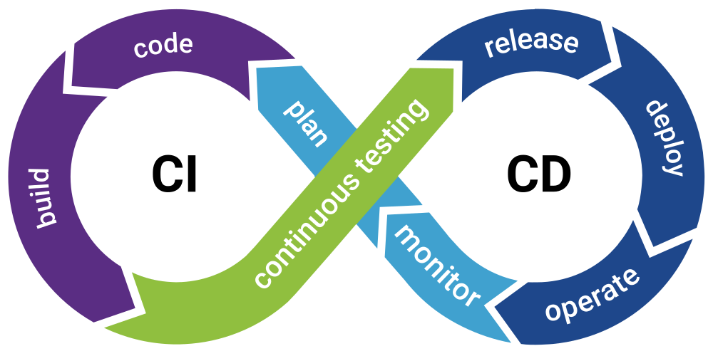
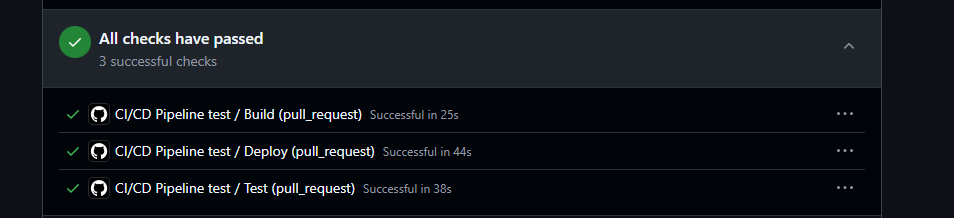
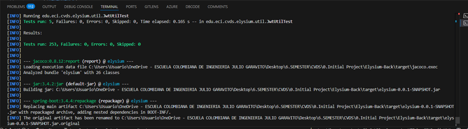
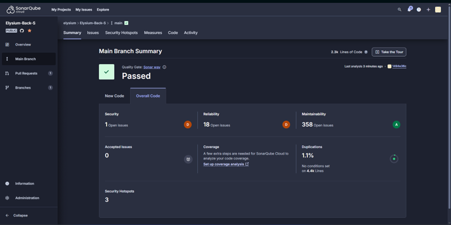

# INTEGRANTES

- Andersson David Sánchez Méndez
- Cristian Santiago Pedraza Rodríguez
- Ricardo Andres Ayala Garzon
- Santiago Botero García

## LABORATORIO 4 - Scrum - DI/IOC

## ELYSIUM

## PRE-RREQUISITOS

- Java OpenJDK Runtime Environment: 17.x.x
- Apache Maven: 3.9.x
- SpringBoot
- Docker
- AzureDevops
- Sonar
- Jacoco

## OBJETIVOS

1. Planeación de un proyecto de software.
2. Entender arquitectura cliente servidor.
3. Inyección de dependencias - Inversión de control.
4. Manejo de bases de datos no relacionales.
5. Definición de API Rest Con SpringBoot.
6. Realizar Análisis estático para garantizar calidad del código y detección de deuda técnica.
7. Integrar pruebas unitarias en el desarrollo del producto.

## CASO DE NEGOCIO - SISTEMA DE RESERVAS DE LABORATORIOS PARA LA DECANATURA DE INGENIERÍA DE SISTEMAS

El proyecto consiste en una aplicación para la gestión de reservas de laboratorios dentro Ingeniería de Sistemas de la Escuela Colombiana de Ingeniería Julio Garavito. Los usuarios podrán consultar la disponibilidad de laboratorios, realizar reservas y cancelar sus reservas desde una interfaz web. La aplicación se conectará a un API REST desarrollado en Spring Boot. El backend permitirá la inyección de dependencias para el manejo de datos, pudiendo optar entre una base de datos en MongoDB Cloud o un archivo de texto plano para almacenar las reservas.

## REQUERIMIENTOS

- El usuario debe poder consultar la disponibilidad de laboratorios.
- El usuario debe poder reservar un laboratorio especificando fecha, hora y propósito.
- El usuario debe poder cancelar sus reservas.
- La aplicación debe validar que un laboratorio no se pueda reservar si ya está ocupado.

## MODELO DE ARQUITECTURA


## PLANEACIÓN DEL PROYECTO

- Esta sección tiene como objetivo realizar toda la planificación que el equipo de desarrollo requiere para poder dar inicio al proyecto planteado. Para este objetivo utilizaremos Azure DevOps.

- <a href="https://github.com/MicrosoftLearning/AZ400-DesigningandImplementingMicrosoftDevOpsSolutions/blob/master/Instructions/Labs/AZ400_M01_L01_Agile_Plan_and_Portfolio_Management_with_Azure_Boards.md">Tutorial Completo</a>

1. Como primer paso, se crean dos repositorios en GitHub, tanto para el backend como para el frontend.

        

2. Todos los integrantes del grupo crean su cuenta en AzureDevOps <a href="https://go.microsoft.com/fwlink/?LinkId=2014881" target="_blank">Crear una cuenta</a>

3. Una vez ingresa deberá crear el proyecto. (Solo lo hace un integrante del equipo). Crea la organización, y dentro de esta crea el proyecto con configuración avanzada tipo de proceso Scrum, con visibilidad privada, y su descripción correspondiente.





4. Cree un equipo en el siguiente tutorial encontrará cómo hacerlo <a href="https://github.com/microsoft/azuredevopslabs/tree/master/labs/azuredevops/agile" target="_blank">Creando equipos</a>, para este proceso todos
     los integrantes deberán tener una cuenta en AzureDevOps.




5. Integre los repositorios de gitHub en la configuración de AzureDevOps
       From your project in Azure DevOps, go to Project settings > GitHub connections.
       To add or remove repositories, select the More options ellipses for the connection and choose Add repositories or Remove repositories from the menu.

   

6. Una vez integrados los repositorios, ahora, se configuran Iteration and Area Paths para habilitar la opción de añadir Épicas al proyecto.

7. Se dirige al nombre del equipo y selecciona la opción del inciso anterior, y habilita Epics.




8. Defina los spring del proyecto. luego para configurar, seleccionar la opción Iterations, select Iterations, determinar las fechas de cada Spring, y eliminar Springs innecesarios.

## SPRINTS

    Sprint 1: Configuración General del Proyecto (SCAFFOLDING)
    - Configuración de ambientes (backend y frontend).
    - Scaffolding del proyecto.
    - Configuración de la base de datos (MongoDB Cloud o archivo de texto plano).
    - Definición del modelo de datos (salones y reservas).

    Sprint 2: Implementación del API REST (BACK AND FRONT)
    - Crear los endpoints necesarios para consultar laboratorios, realizar reservas y cancelar reservas.
    - Implementar la lógica de validación para evitar reservas conflictivas.
    - Configurar la persistencia de datos en MongoDB Cloud o archivo de texto plano.

    Sprint 3: Conexión del Frontend con el API y Pruebas Finales (BACK AND FRONT)
    - Desarrollar la interfaz web para visualizar disponibilidad y gestionar reservas.
    - Conectar la interfaz web con el API REST.
    - Realizar pruebas de integración y validación de funcionalidades.




9. Incluir subáreas para poder añadir las épicas correctamente. Para esto, se selecciona Areas, y en el nombre del proyecto se incluyen las subáreas, y se le da Ok.


10. Definiendo la épica, y añadirlas en el proyecto, dándole en la sección de Board Work Items --> Work Items --> new work item --> Epic --> con la descripción correspondiente.

## ÉPICAS

1. Scaffolding: Crear la estructura del proyecto con Maven, así como también la configuración con MongoDB, y la definición del modelo de datos.
2. Frontend: Crear una interfaz de usuario que permita visualizar la disponibilidad y gestionar reservas.
3. Backend: Implementar un API REST para el manejo de la lógica de negocio y persistencia de datos.


11. Definir y añadir features para cada Epic. Para esto, se selecciona add link y en New Item se pone el nuevo feature.

## FEATURES

1. Consultar Disponibilidad: El usuario puede consultar la disponibilidad de laboratorios para una fecha y hora específicas.
2. Reservar Laboratorio: El usuario puede reservar un laboratorio seleccionando fecha, hora y propósito.
3. Cancelar Reserva: El usuario puede cancelar sus reservas existentes.
4. Validación de Reservas: Evitar reservas duplicadas para un mismo laboratorio, fecha y hora.
5. Notificación de Reserva Exitosa: Enviar una confirmación al usuario después de realizar la reserva.


12. Defina las historias de usuario por cada feature definida.

13. Defina las tareas asociadas a cada historia de usuario. Estime tiempos y programe cada actividad con su equipo (squad)

## PASOS PARA CONSTRUIR EL PROYECTO

1- Definir el scaffolding del back <a href="https://ragunathrajasekaran.medium.com/https-medium-com-ragunathrajasekaran-lets-learn-full-stack-development-part2-7986debc485d" target="_blank">Ver guía</a> No olvide el que el proyecto debe ser maven. Mantenga el esquema de nombramiento de los artefactos.


## IMPLEMENTACIÓN

De acuerdo a la planeación realizada divida las tareas de implementación.
A continuación detallamos diferentes tutoriales para el manejo técnico para cada etapa.

1. Creación de proyecto APIREST <a href="https://blog.codmind.com/mi-primer-api-rest-con-spring-boot/">Documentación 1<a/> <a href="https://programandoenjava.com/crear-un-rest-api-con-spring-boot/">Documentación 2</a>
2. Consumir APIREST HTML - JAVASCRIPT <a href="https://helpcenter.itmplatform.com/es/project/ejemplo-de-uso-de-api-con-html-javascript/">Ejemplo básico<a/> Utilizar buenas prácticas de programación separación en archivos emplear CSS para mejorar la usabilidad.
3. Configuración e integración <a href="https://www.mongodb.com/resources/products/compatibilities/spring-boot#getting-started-with-spring-initializr">MongoDB - Atlas</a>
4. Utilizar integración con Sonar y JACOCO para análisis estático y calidad del código, esto implica el desarrollo de pruebas unitarias.


# Descripcion de Elysium Backend

Elysium Backend esta echo para la gestión de reservas de espacios y equipos de compututacion en la universidad Escuela Colombiana de Ingenieria.

## Tabla de Contenidos
1. [Introducción](#introducción)
2. [Tecnologías y Herramientas](#tecnologías-y-herramientas)
3. [Arquitectura del Sistema](#arquitectura-del-sistema)
4. [Estructura del Código](#estructura-del-código)
5. [DTO (Data Transfer Object)](#dto-data-transfer-object)
6. [Modelos](#modelos)
7. [Endpoints / API](#endpoints--api)
8. [Pruebas y Calidad](#pruebas-y-calidad)
9. [Guía de Configuración y Despliegue](#guía-de-configuración-y-despliegue)
10. [Notas Adicionales / Contribución](#notas-adicionales--contribución)

## Introducción
Este proyecto tiene como objetivo permitir la administración de reservas de espacios y equipos de computacion dentro de la universidad. Los usuarios pueden realizar reservas, gestionar recursos y reservas, y consultar disponibilidad de espacios a través de una la API.

### Arquitectura General
El backend sigue una arquitectura basada en servicios, con capas de controladores, servicios, repositorios y modelos de datos. Se ha diseñado siguiendo el patrón MVC (Modelo-Vista-Controlador) para una mejor separación de responsabilidades.

## Tecnologías y Herramientas
- **Lenguaje:** Java 17
- **Framework:** Spring Boot
- **Base de datos:** PostgreSQL, MongoDB
- **ORM:** Spring Data JPA, Spring Data MongoDB
- **Documentación:** Swagger/OpenAPI
- **Gestión de dependencias:** Maven
- **Pruebas:** JUnit, Mockito

## Arquitectura del Sistema
Este backend sigue una arquitectura monolítica con una clara separación de capas:
1. **Controladores:** Manejan las peticiones HTTP y delegan la lógica a los servicios.
2. **Servicios:** Contienen la lógica de negocio y la interacción con los repositorios.
3. **Repositorios:** Interactúan con la base de datos utilizando JPA o MongoDB.
4. **Modelos:** Representan las entidades del dominio del negocio.

### Patrones de Diseño Implementados
- **MVC (Modelo-Vista-Controlador)**: Separación de responsabilidades.
- **Repository Pattern**: Para la abstracción de acceso a datos.
- **DTO (Data Transfer Object)**: Para optimizar el intercambio de datos en la API.

## Estructura del Código en el main
```plaintext
src/main/java/edu/eci/cvds/elysium/
├── config
│   ├── CorsConfig.java
├── controller
│   ├── usuario
│   │   ├── AdministradorController.java
│   │   ├── ApiOperation
│   │   ├── EstandarController.java
│   ├── RecursoController.java
│   ├── ReservaController.java
│   ├── SalonController.java
├── dto
│   ├── salon
│   │   ├── SalonDTO.java
│   ├── usuario
│   │   ├── UsuarioDTO.java
│   ├── RecursoDTO.java
│   ├── ReservaDTO.java
├── model
│   ├── usuario
│   │   ├── DiaSemana.java
│   │   ├── EstadoReserva.java
│   │   ├── Recurso.java
│   │   ├── Reserva.java
│   │   ├── Salon.java
├── repository
│   ├── RecursoRepository.java
│   ├── ReservaRepository.java
│   ├── SalonRepository.java
│   ├── UsuarioRepository.java
├── service
│   ├── impl
│   ├── usuario
│   ├── RecursoService.java
│   ├── RecursoServiceImpl.java
│   ├── ReservaService.java
│   ├── ReservaServiceImpl.java
│   ├── salonService.java
│   │   ├── AdministradorService.java
├── ElysiumApplication.java
├── ElysiumExceptions.java
└── resources
```

## DTO (Data Transfer Object)
Los DTOs se utilizan para transportar datos entre las distintas capas del sistema sin exponer directamente las entidades del modelo de datos. Esto mejora la seguridad y flexibilidad en la API.

### Ejemplo: `SalonDTO`
```java
package edu.eci.cvds.elysium.dto.salon;

import java.util.List;
import edu.eci.cvds.elysium.model.Recurso;
import jakarta.validation.constraints.Negative;
import jakarta.validation.constraints.NotNull;

public class SalonDTO {
    @NotNull(message = "El mnemonico no puede ser nulo")
    private String mnemonico;
    private String nombre;
    private String descripcion;
    @NotNull(message = "La ubicacion no puede ser nula")
    private String ubicacion;
    @NotNull(message = "La capacidad no puede ser nula")
    @Negative(message = "La capacidad no puede ser negativa")
    private Integer capacidad;
    @NotNull(message = "Los recursos no pueden ser nulos")
    private List<Recurso> recursos;
    private Boolean activo;
    private Boolean disponible;
}
```

## Modelos
Los modelos representan las entidades principales de la base de datos.

### Ejemplo: `Recurso`
```java
package edu.eci.cvds.elysium.model;

import org.springframework.data.annotation.Id;
import org.springframework.data.mongodb.core.mapping.Document;
import java.util.List;

@Document(collection = "recursos")
public class Recurso {
    @Id
    private String id;
    private String nombre;
    private int cantidad;
    private List<String> especificaciones;
    private boolean activo;
}
```

## Endpoints / API
### Usuario
- `GET /api/administrador/{id}/usuario` - Consulta un usuario por ID.
- `GET /api/administrador/usuarios` - Consulta usuarios con filtros opcionales.
- `POST /api/administrador/usuario` - Agrega un usuario.
- `PATCH /api/administrador/usuario/{id}` - Actualiza información de un usuario.

### Salón
- `POST /api/administrador/{id}/salon` - Agrega un nuevo salón.

### Reserva
- `POST /api/administrador/{id}/reserva` - Crea una nueva reserva.

## Pruebas y Calidad
- **Pruebas unitarias:** JUnit.
- **Cobertura de código:** Se busca mantener un mínimo del 85%.
- **Estrategia de pruebas:**
    - Pruebas de unidad en los servicios.
    - Pruebas de integración para verificar la correcta interacción con la base de datos.

## Guía de Configuración y Despliegue
### Configuración del Entorno de Desarrollo
1. Clonar el repositorio.
2. Instalar dependencias con Maven:
   ```sh
   mvn clean install
   ```
3. Configurar las variables de entorno para la conexión a PostgreSQL y MongoDB.
4. Iniciar la aplicación:
   ```sh
   mvn spring-boot:run
   ```

### Despliegue
Para desplegar en producción:
1. Generar el archivo JAR:
   ```sh
   mvn package
   ```
2. Ejecutar con:
   ```sh
   java -jar target/elysium-backend.jar
   ```

## Notas Adicionales / Contribución
- Seguir la guía de estilo de código de Java.
- Utilizar PRs para contribuir al proyecto.
- Documentar cualquier nuevo endpoint en Swagger.
- Posibles mejoras: Implementación de autenticación y autorización con JWT.

---
📌 **Elysium Backend** - Proyecto para la gestión de reservas de espacios y equipos de computacion.

